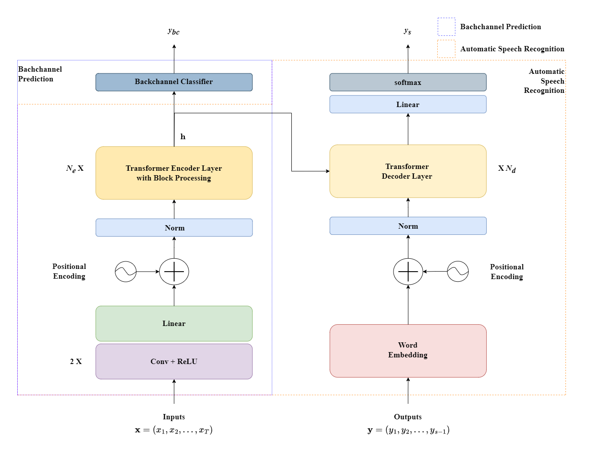

# Streaming Backchannel Prediction Model

## Introduction

This repository contains the implementation of our research paper "[Joint streaming model for backchannel prediction and automatic speech recognition](https://onlinelibrary.wiley.com/doi/full/10.4218/etrij.2023-0358)" published in ETRI Journal. The model is designed to simultaneously perform real-time speech recognition and backchannel prediction.


## Architecture



The model implements a joint streaming architecture that enables:
- Concurrent processing of ASR and backchannel prediction tasks
- Real-time processing capabilities

## Requirements

This project is built using:
- python==3.8.20
- espnet==202301
- torch==1.13.1

For detailed dependencies, please refer to `requirements.txt`.

## Installation

1. Clone the repository:
```bash
>>> git clone https://github.com/etri/etri-miai.git
>>> cd etri-miai/backchannel/streaming_bcp
```

2. Setup:
```bash
>>> conda create -n myenv python=3.8
>>> conda activate myenv
>>> pip install -r requirements.txt
```

## Usage
### 1. Data Preparation
For detailed configuartion, please refer to [`baseline.yaml`](database_manager/baseline.yaml)
```bash
>>> cd database_manager
>>> python 0.build_espnet_dataset.py
```
### 2. Train | Inference | Scoring
```bash
>>> bash run.sh
```

## Citation

If you use this code in your research, please cite our paper:

```bibtex
@article{
  title = {Joint Streaming Model for Backchannel Prediction and Automatic Speech Recognition},
  author = {Choi, Yong-Seok and Bang, Jeong-Uk and Kim, Seung Hi},
  year = {2024},
  journal = {ETRI Journal},
  volume = {46},
  number = {1},
  pages = {118--126},
  issn = {2233-7326},
  doi = {10.4218/etrij.2023-0358},
  urldate = {2025-02-06},
  langid = {english},
  keywords = {automatic speech recognition,backchannel prediction,block processing,multitask learning,streaming fashion,streaming transformer},
}

```
## License

This project is licensed under the MIT License - see the [LICENSE](LICENSE) file for details.

## Acknowledgments

Institute of Information & Communications Technology Planning & Evaluation (IITP) grant funded by the Korea government (MSIT) (no. 2022-0-00608; Development of artificial intelligence technology of multimodal interaction for empathetic and social conversations with humans).